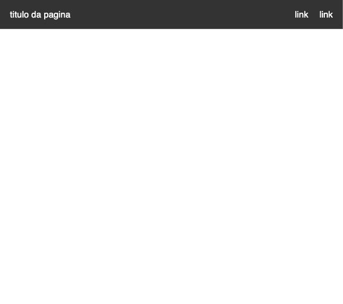

# Estilizando o HEADER

Vamos criar os estilos CSS conforme solicitado e explicar cada parte do código de maneira simples com comentários.

O resultado obtido deverá ser parecido com a imagem abaixo



### Código HTML

Seu código provavelmente se parecerá com o código abaixo.

```html
<header>
  <nav>
    <h1>titulo da pagina</h1>
    <ul>
      <li><a href="#">link</a></li>
      <li><a href="#">link</a></li>
    </ul>
  </nav>
</header>
```

### Estilos CSS

---

Agora, vamos adicionar os estilos CSS para atingir o layout desejado.

`<header>`

Para estilizar o header e a navegação iremos definir as seguintes propriedades no css da página.

**`header`**

- a tag `header` devera ter a largura ocupando toda a tela. para isso usamos a propriedade `width` definida para `100%`com um espaçamento `padding`de `18px` e o background continua `#333` e a cor do texto definida para branco usando o `color` definido como `#fff`

- a tag `nav` devera organizar seu conteúdo na horizontal e para isso usaremos a propriedade `display` definida como `flex`. Para colocar o titulo em uma ponta e os links na outra, vamos definir a propriedade `justify-content` para `space-between` e o `align-items` definida como `center` e vai centralizar o conteúdo verticalmente ao centro

- para a tag `ul` também definiremos o `display` como `flex` o `list-style-type` definido como `none` para remover os estilos de lista.

- para a tag `li` defina um `padding` de `8px`e uma margem direita `margin-right` em `24px`

- a tag `a` terá sua cor definida para branco usando a propriedade `color` como `#fff`. Também removeremos o sublinhado do link com a propriedade `text-decoration` como `none`

### Explicação dos Estilos

---

- **`header`**

  - `color: #fff;`: define a cor do texto para branco
  - `padding: 18px;`: Adiciona um padding de 18 pixels ao redor do conteúdo do header.
  - `background-color: #333;`: Define a cor de fundo do header como cinza escuro (#333).

- **`nav`**

  - `display: flex;`: Usa o Flexbox para organizar os elementos filhos.
  - `justify-content: space-between;`: Distribui os elementos filhos (h1 e ul) com o máximo de espaço possível entre eles.
  - `align-items: center;`: Alinha os elementos filhos verticalmente ao centro.

- **`ul`**

  - `display: flex;`: Exibe os itens da lista na horizontal.
  - `list-style-type: none;`: Remove os marcadores de lista padrão.
  - `padding: 0;`: Remove o padding padrão da lista.
  - `margin: 0;`: Remove a margem padrão da lista.

- **`li`**

  - `margin-left: 20px;`: Adiciona um espaço de 20 pixels à esquerda de cada item da lista, exceto o primeiro item.

- **`a`**
  - `color: white;`: Define a cor do texto dos links como branco.
  - `text-decoration: none;`: Remove o sublinhado dos links.
